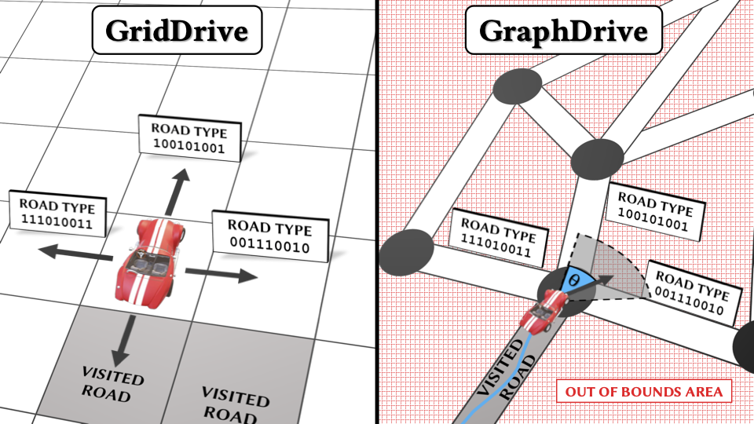
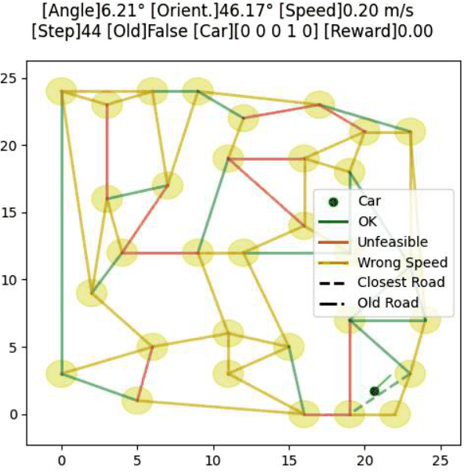
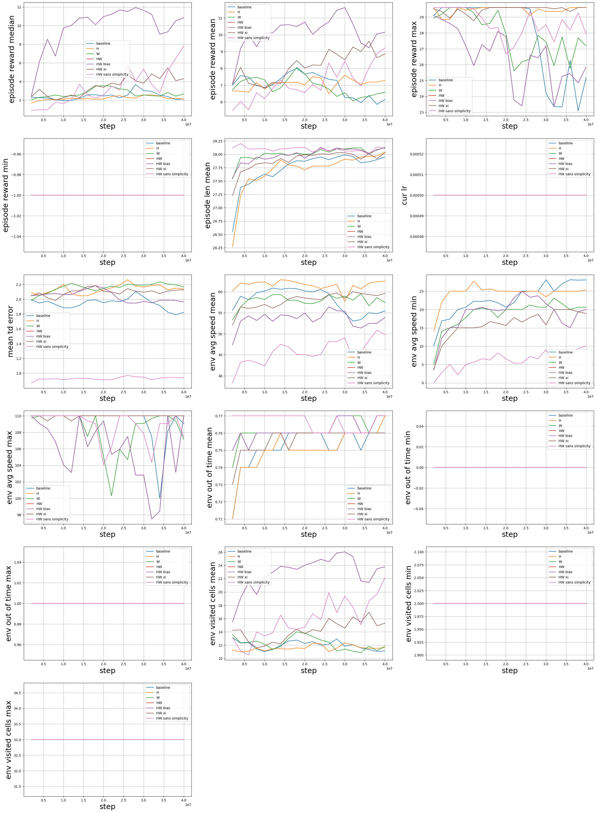

# Explanation-Aware Experience Replay in Rule-Dense Environments

Code accompanying the paper
> ["Explanation-Aware Experience Replay in Rule-Dense Environments"](https://arxiv.org/abs/2109.14711)

XARL is a pip-installable python library, extending [RLlib](https://www.ray.io/rllib) with explanation-awareness capabilities, as described in our paper [Explanation-Aware Experience Replay in Rule-Dense Environments](https://arxiv.org/abs/2109.14711).
This implementation of XARL supports:
- DQN
- DDPG
- TD3
- SAC
- PPO

XARL comes also with 2 new environments:
- **GridDrive**: A 15×15 grid of cells, where every cell represents a different type of road (see Figure 2, left), with base types (e.g. motorway, school road, city) combined with other modifiers (roadworks, accidents, weather). Each vehicle will have a set of properties that define which type of vehicle they are (emergency, civilian, worker, etc). Complex combinations of these properties will define a strict speed limit for each cell, according to the culture. 
- **GraphDrive**: An Euclidean representation of a planar graph with n vertices and m edges. The agent starts at the coordinates of one of those vertices and has to drive be- tween vertices (called ‘junctions’) in continuous space with Ackermann-based non-holonomic motion. Edges represent roads and are subjected to the same rules with properties to those seen in GridDrive plus a few extra rules to encourage the agent to stay close to the edges. The incentive is to drive as long as possible without committing speed infractions. In this setting, the agent not only has to master the rules of the roads, but also the control dynamics to steer and accelerate correctly. We test two variations of this environment: one with dense and another with sparse rewards. 

*Environments*


*Screenshot of GraphDrive*

  
## Installation
This project has been tested on Debian 9 and macOS Mojave 10.14 with Python 3.7.9 and 3.8.6. 
The script [setup.sh](setup.sh) can be used to install XARL and and the environments in a python3 virtualenv.

You can also install XARL by downloading this repo and running from within it: 
`pip install --use-deprecated=legacy-resolver -e package`

Before being able to run the [setup.sh](setup.sh) script you have to install: virtualenv, python3-dev, python3-pip and make. 

## Usage
To use XARL in your own project, please give a look to the boilerplate code in the demos, i.e. [demos/DQN/GridDrive-Easy/HW.py](demos/DQN/GridDrive-Easy/HW.py). Remember to change the different hyper-parameters according to your needs.
You should also change the step function in your environment so that it returns also an explanation label attached to the reward, as show in the function `step` inside [environments/car_controller/grid_drive/grid_drive.py](environments/car_controller/grid_drive/grid_drive.py).

## Hyper-Parameters
XARL comes with a vast set of hyper-parameters. The majority of them are inherited from RLlib, but some of them are new.
The new hyper-parameters are:
```
"buffer_options": {
	'priority_id': 'td_errors', # Which batch column to use for prioritisation. Default is inherited by DQN and it is 'td_errors'. One of the following: rewards, prev_rewards, td_errors.
	'priority_lower_limit': 0, # A value lower than the lowest possible priority. It depends on the priority_id. By default in DQN and DDPG it is td_error 0, while in PPO it is gain None.
	'priority_aggregation_fn': 'np.mean', # A reduction that takes as input a list of numbers and returns a number representing a batch priority.
	'cluster_size': None, # Default None, implying being equal to global_size. Maximum number of batches stored in a cluster (which number depends on the clustering scheme) of the experience buffer. Every batch has size 'replay_sequence_length' (default is 1).
	'global_size': 2**14, # Default 50000. Maximum number of batches stored in all clusters (which number depends on the clustering scheme) of the experience buffer. Every batch has size 'replay_sequence_length' (default is 1).
	'clustering_xi': 1, # Let X be the minimum cluster's size, and q be the clustering_xi, then the cluster's size is guaranteed to be in [X, X+qX]. This shall help having a buffer reflecting the real distribution of tasks (where each task is associated to a cluster), thus avoiding over-estimation of task's priority.
	'prioritization_alpha': 0.6, # How much prioritization is used (0 - no prioritization, 1 - full prioritization).
	'prioritization_importance_beta': 0.4, # To what degree to use importance weights (0 - no corrections, 1 - full correction).
	'prioritization_importance_eta': 1e-2, # Used only if priority_lower_limit is None. A value > 0 that enables eta-weighting, thus allowing for importance weighting with priorities lower than 0 if beta is > 0. Eta is used to avoid importance weights equal to 0 when the sampled batch is the one with the highest priority. The closer eta is to 0, the closer to 0 would be the importance weight of the highest-priority batch.
	'prioritization_epsilon': 1e-6, # prioritization_epsilon to add to a priority so that it is never equal to 0.
	'prioritized_drop_probability': 0, # Probability of dropping the batch having the lowest priority in the buffer instead of the one having the lowest timestamp. In DQN default is 0.
	'global_distribution_matching': False, # Whether to use a random number rather than the batch priority during prioritised dropping. If True then: At time t the probability of any experience being the max experience is 1/t regardless of when the sample was added, guaranteeing that (when prioritized_drop_probability==1) at any given time the sampled experiences will approximately match the distribution of all samples seen so far.
	'cluster_prioritisation_strategy': 'sum', # Whether to select which cluster to replay in a prioritised fashion -- Options: None; 'sum', 'avg', 'weighted_avg'.
	'cluster_prioritization_alpha': 1, # How much prioritization is used (0 - no prioritization, 1 - full prioritization).
	'cluster_level_weighting': True, # Whether to use only cluster-level information to compute importance weights rather than the whole buffer.
	'max_age_window': None, # Consider only batches with a relative age within this age window, the younger is a batch the higher will be its importance. Set to None for no age weighting. # Idea from: Fedus, William, et al. "Revisiting fundamentals of experience replay." International Conference on Machine Learning. PMLR, 2020.
},
"clustering_scheme": "HW", # Which scheme to use for building clusters. One of the following: "none", "positive_H", "H", "HW", "long_HW", "W", "long_W".
"clustering_scheme_options": {
	"episode_window_size": 2**6, 
	"batch_window_size": 2**8, 
	"n_clusters": None,
},
"cluster_selection_policy": "min", # Which policy to follow when clustering_scheme is not "none" and multiple explanatory labels are associated to a batch. One of the following: 'random_uniform_after_filling', 'random_uniform', 'random_max', 'max', 'min', 'none'
"cluster_with_episode_type": False, # Useful with sparse-reward environments. Whether to cluster experience using information at episode-level.
"cluster_overview_size": 1, # cluster_overview_size <= train_batch_size. If None, then cluster_overview_size is automatically set to train_batch_size. -- When building a single train batch, do not sample a new cluster before x batches are sampled from it. The closer cluster_overview_size is to train_batch_size, the faster is the batch sampling procedure.
"collect_cluster_metrics": False, # Whether to collect metrics about the experience clusters. It consumes more resources.
"ratio_of_samples_from_unclustered_buffer": 0, # 0 for no, 1 for full. Whether to sample in a randomised fashion from both a non-prioritised buffer of most recent elements and the XA prioritised buffer.
```

## Experiments
XARL comes with a few demos for DQN, SAC and TD3, respectively on GridDrive and GraphDrive. 
These demos have the same configuration of hyper-parameters used in the experiments of [Explanation-Aware Experience Replay in Rule-Dense Environments](https://arxiv.org/abs/2109.14711). 
You may find all the demo scripts inside: [demos](demos).

Inside the directory [images/experiments](images/experiments) you may find some plots obtained by performing an ablation study on a few selected hyper-parameters.
In these plots, the default configuration is always HW (usually the red solid line meaning that How-Why explanations are used) with the same hyper-parameters used for the demos named HW. While all the other configurations are slight variations of HW.
For example, as shown in the following image we have:
- baseline: HW with `"clustering_scheme": None`
- H: only How explanations; HW with `"clustering_scheme": 'H'`
- W: only Why explanations; HW with `"clustering_scheme": 'W'`
- HW bias: HW with `"'cluster_level_weighting': False`
- HW xi: HW with `"clustering_xi": 1` for SAC or `"clustering_xi": 3` for DQN/TD3
- HW sans simplicity: HW with `'cluster_prioritisation_strategy': None`

*DQN - GridDrive Medium*


## RLlib Patches
RLlib has some known issues with PPO.
For running any experiment on PPO with Tensorflow, to avoid raising a NaN error during training (a.k.a. run-time crash), add the following lines to ray/rllib/models/tf/tf_action_dist.py, after line 237
```
        log_std = tf.clip_by_value(log_std, MIN_LOG_NN_OUTPUT, MAX_LOG_NN_OUTPUT) # Clip `scale` values (coming from NN) to reasonable values.
```
For running any experiment on PPO with PyTorch, to avoid raising a NaN error during training (a.k.a. run-time crash), add the following lines to ray/rllib/models/torch/torch_action_dist.py, after line 159
```
        log_std = torch.clamp(log_std, MIN_LOG_NN_OUTPUT, MAX_LOG_NN_OUTPUT)
```

## Citations
This code is free. So, if you use this code anywhere, please cite our journal paper:
```
@article{sovrano2021explanation,
  title={Explanation-Aware Experience Replay in Rule-Dense Environments},
  author={Sovrano, Francesco and Raymond, Alex and Prorok, Amanda},
  journal={IEEE Robotics and Automation Letters},
  volume={7},
  number={2},
  pages={898--905},
  year={2021},
  publisher={IEEE}
}
```

Thank you!

## Support
For any problem or question please contact me at `cesco.sovrano@gmail.com`
